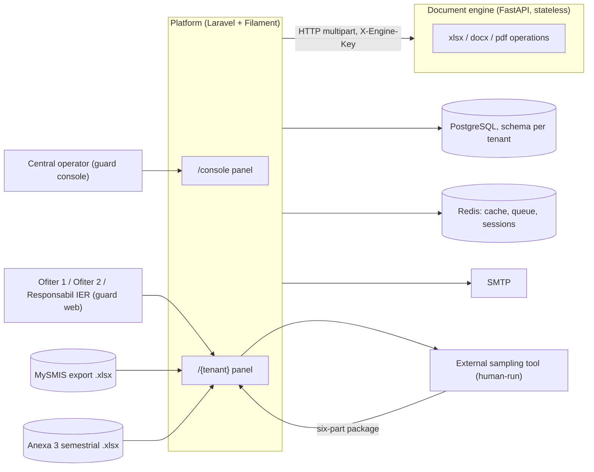
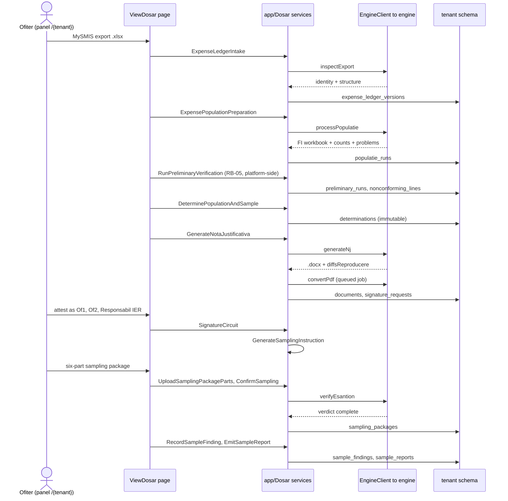

# Architecture

The system, independent of where it runs; every claim cites its source path. Ownership:
`CLAUDE.md` ch. 2. Business-level pictures: `docs/architecture-c4.md`.

## System

OIR Flow — multi-tenant CR/CP sampling platform (`composer.json`). Two deployable
contexts, coupled only through `contract/`:

- **Platform** — Laravel ^13.5 on PHP ^8.5, Filament ^5, Pest; `stancl/tenancy` ^3.9,
  `spatie/laravel-permission` ^8.3 (`composer.json`). Holds all business rules, state,
  and tenancy.
- **Document engine** — stateless Python ≥3.12 FastAPI service; its build version is
  `version` in `engine/pyproject.toml`. Performs every Office-file operation
  (.xlsx/.docx/.pdf); no database, no sessions, no durable writes; tenancy-unaware.

## Contract boundary (`contract/`)

- `openapi.yaml` 0.1.1 — system REST boundary.
- `engine.openapi.yaml` — platform ↔ engine seam; its `info.version` is the single source
  of the seam version and is never restated elsewhere (ADR-0025). Engine implements it;
  platform consumes it via the bridge client (`app/Engine/EngineClient.php`). Seam detail,
  pins included: `docs/document-engine-bridge.md`.
- `asyncapi.yaml` 0.1.1 — event boundary.
- `.spectral.yaml` — lint ruleset; invocation in `docs/runbook.md`.
- Engine access needs a mandatory shared secret: without one the deployment stays alive but
  unservable — guarded operations answer 503 `shared-secret-absent`, `/health` `degraded`
  (`engine/app/settings.py`, `infra/ci/engine/unconfigured_probe.py`). Per-runtime
  configuration: Runtimes below.

## Runtimes

Each runtime owns its file; nothing here depends on which one is up:

| runtime | file |
|---|---|
| local development | `docs/topology/local.md` |
| preview | `docs/topology/preview.md` |

- Inputs more than one runtime reads live once in `infra/shared/`, owned by no runtime:
  Redis config (`redis/redis.conf`) and the engine image definition with its
  dependency lock (`engine/`). No runtime holds a copy, and no runtime resolves a path
  into another runtime's directory.
- A further runtime adds one file to `docs/topology/` and one row above; nothing else changes.

## Tenancy

Schema-per-tenant on one PostgreSQL database; project-owned mechanism in `app/Tenancy/**`.

- Central migrations `database/migrations/`; tenant set `database/migrations/tenant/`;
  DB-global objects in an `extensions` schema (`0001..create_extensions_schema.php`).
- `tenants.id` IS the slug; schema name derived from it (`app/Tenancy/TenantSlug.php`).
  Tenant resolved from the first URL path segment (`AppPanelProvider` path `{tenant}`).
- Provisioning pipeline: validate slug → create schema → migrate → seed → first
  administrator → activate (`app/Tenancy/TenantProvisioner.php`); append-only lifecycle
  journal (`TenantLifecycleJournal`); cross-tenant migration drift asserted by
  `tenants:drift-check` (`TenantDriftInspector`).
- A tenancy switch is refused while a transaction is open on the default connection:
  `RefuseTenancySwitchInsideTransaction` on stancl's `InitializingTenancy`/`EndingTenancy`
  (ADR-0033).
- Redis keyspaces: cache DB 1; queue/session/locks DB 0. Eviction is disabled
  (`infra/shared/redis/redis.conf`) ⇒ every cache entry needs an explicit TTL
  (`config/cache.php`).

## Platform layout (`app/`)

| area | contents |
|---|---|
| `Dosar/` | case lifecycle: state machine (`DosarLifecycle`), expense-ledger intake/versioning, population runs, determination, sampling, sample verification, NJ documents, signature circuit; `Storage/` adapters are domain-owned |
| `Engine/` | bridge client: `EngineClient`, RFC 9457 problem mapping, multipart parsing, per-operation budgets, returned audit events |
| `Tenancy/` | schema-per-tenant mechanism (data tier) |
| `RiskRegister/` | risk-index domain and contracting-workbook import; `Storage/` adapters (data tier) behind `RiskIndexSourceRepository`, `ContractImportRepository` and `RiskRegisterVersionRepository` |
| `Auth/` | security event log, credential flows |
| `Models/`, `Enums/` | Eloquent models, enums |
| `Filament/`, `Http/`, `Mail/`, `Listeners/`, `Providers/`, `Console/` | panels/resources, HTTP layer, mail, listeners, providers, artisan commands |

Panels (`app/Providers/Filament/`): `/console` — central operators, guard `console`,
`ConsoleUser` model; `/{tenant}` — tenant app, guard `web`.

## Engine layout (`engine/`)

`app/main.py` (FastAPI app) · `app/routes/` — health, populatie, nj, anexa3, esantion,
export_inspect, pdf, tabular, stubs (mounted, empty) · vendored validated prototype modules
(`vendor/modul_a_populatie`, `vendor/modul_b_nj`) re-exposed via `app/vendored.py` ·
black-box HTTP tests `engine/tests/`. No published path answers 501; what is unserved is
narrower — the `associations` and `ier-list` profiles of `POST /tabular/parse`.

## Runtime behaviour

- Central operators work in `/console`: provision, suspend and archive tenants, manage
  console accounts, read the lifecycle journal. A console account grants nothing inside a
  tenant (`app/Auth/ConsoleAdministrators.php`, `app/Filament/Console/Resources/`).
- Tenant users work in `/{tenant}`: dosar registry, the ViewDosar workstation — 17 actions
  (`app/Filament/Resources/Dosare/Pages/ViewDosar.php`) — Utilizatori and project registers,
  risk-index ingest and consultation, risk-class intervals, contracting-workbook import
  (`import-contracte`, `{document}/elemente`, `{document}/exceptii`) (`app/Filament/Pages/`).
- A dosar carries four independent state dimensions (`app/Dosar/DosarState.php`), written
  only by `DosarLifecycle` through nine declarative transition rules
  (`app/Dosar/DosarTransitions.php`); a rejected transition throws and changes nothing.
- The engine serves five spine operations — inspectExport, processPopulatie, generateNj,
  convertPdf, verifyEsantion — plus parseAnexa3 and parseTabular for the register. RB-05 is
  platform-side (`app/Dosar/Verification/Rb05Conformity.php`); the rest of that division:
  `docs/document-engine-bridge.md`.
- Durable state lands in the tenant's own schema, workbooks and documents as `bytea`
  (`app/Dosar/Storage/`, `app/Tenancy/TenantKeyspace.php`); Redis holds cache, sessions
  and the central queue; the engine persists nothing (`engine/app/deps.py`).
- An engine problem (`app/Engine/ProblemMapper.php`), a surviving NJ reproduction diff
  (`app/Engine/Nj/DiffsReproducereFilter.php`) or an incomplete/mismatch verify verdict
  aborts its step and leaves state unchanged (`app/Dosar/Sampling/ConfirmSampling.php`).
- Credential mail sends unconditionally through the injected `Mailer`, ungated —
  `app/Auth/{TenantUserActivation,PasswordSetupLink,TenantPasswordReset}.php`.
- Case-workflow notices are gated on `notifications.channel`, seeded NULL and written by no
  surface (`database/seeders/TenantDatabaseSeeder.php`), so they resolve to `log_only`:
  `app/Dosar/{Signature/SignatureNotifier,SampleVerification/SampleVerificationNotifier,Sampling/SamplingInstructionNotifier}.php`.
  The clarification draft only reads the flag and the assignment notice always logs —
  neither has a send path (`app/Dosar/Verification/ClarificationDraft.php`,
  `app/Dosar/DosarLifecycle.php`).
- The sampling instruction emits the literal `locatia de arhivare configurata a
  tenantului` (`app/Dosar/Sampling/GenerateSamplingInstruction.php`); `archive.root_path`
  is seeded NULL and never read, and no archive tree is written
  (`app/Dosar/Documents/ArchiveDossierPackage.php`).
- The register has two import paths: delimited association sources are read platform-side
  with no engine call (`app/RiskRegister/DelimitedAssociationReader.php`); the contracting
  workbook crosses the seam through `parseTabular`, and is retained, versioned and decided
  line by line (`app/RiskRegister/ContractImport.php`, ADR-0030).
- IER ingest retains the source and opens one register version in the same act (ADR-0058);
  consultation reads that snapshot, never a live `Project` join. `risk_index_sources` stays
  append-only evidence.
- One business act, one transaction, opened by the use-case class: the `dosare` root lock is
  its first statement, and mail, queued work and log lines follow the commit (ADR-0033).
- Dosar transitions journal to the application log, not `audit_trail`
  (`app/Dosar/DosarLifecycle.php`); every dosar gate reduces to an authenticated tenant
  user (`app/Filament/Resources/Dosare/DosarResource.php`).

## CI — gates

One script layer: every gate is a script in `infra/ci/`, running identically on a developer
machine and on the CI host. The host rule binds TOOLS — a host `npx`, PHP or Python lints
nondeterministically — so a gate needs Docker and nothing else, and one invoking no such tool
needs no container (`env-contract`, `adr-citations`). Commands: `docs/runbook.md`; host wiring:
`docs/ci/gitlab.md`.

| gate | what it proves |
|---|---|
| contract | the three contract files satisfy `.spectral.yaml` |
| engine | engine suite against the built engine image, in-process, plus the unconfigured-deployment probe |
| platform | Pest against PostgreSQL and Redis, engine faked |
| seam | bridge client against a live engine, including 401-vs-503 |
| static-analysis | Pint and PHPStan/Larastan level 5 (`phpstan.neon`) |
| env-contract | root `.env.example`, `infra/deploy/.env.example` and the anchor `x-platform-environment` declare one key set, asserted BOTH ways (forward alone passes trivially on a source that lost a key) |
| deploy-stack | the preview runtime definition interpolates and both preview images build; the stack start is a named skip, never a silent one |
| adr-citations | every `ADR-nnnn` named by tracked source resolves to a `docs/adr/` record; `.md` under `docs/` is out of scope, since prose may name a retired number |

- Gate serialization on one machine: `docs/runbook.md` § CI gates.
- No gate starts, stops, or deploys a runtime (ADR-0029); starting the preview runtime is an
  operator action only (`docs/topology/preview.md`).
- No gate filters by changed path: a gate that passes by absence is a defect.
- `adr-citations` is green: every `ADR-nnnn` named by tracked source resolves to a
  `docs/adr/` record.
- Nothing in the set lints shell, though every gate is one; `static-analysis` covers PHP
  only. State and command: `docs/runbook.md` § Shell lint.
