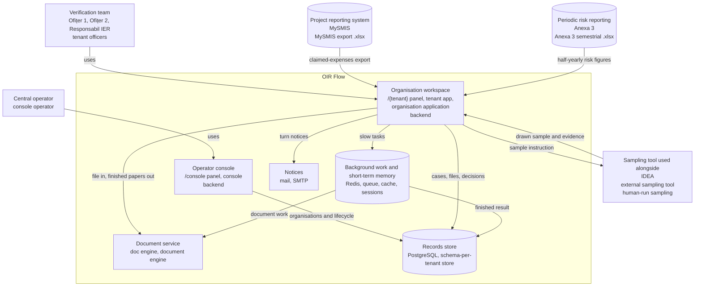

# C4 Level 2 — with aliases

Same six internal parts as `docs/architecture-c4.md` Level 2, plus the three Level 1
externals so business names have a box. Aliases sit on every box; install-agnostic.

| C4 name | Aliases |
|---|---|
| Project reporting system | MySMIS, MySMIS export `.xlsx` |
| Periodic risk reporting | Anexa 3, Anexa 3 semestrial `.xlsx` |
| Sampling tool used alongside | IDEA, external sampling tool, human-run sampling |
| Operator console | `/console` panel, console, backend |
| Organisation workspace | `/{tenant}` panel, tenant app, organisation application, backend |
| Document service | doc engine, document engine |
| Records store | PostgreSQL, schema-per-tenant store |
| Background work and short-term memory | Redis, queue, cache, sessions |
| Notices | mail, SMTP |
| Central operator | console operator |
| Verification team (Ofițer 1, Ofițer 2, Responsabil IER) | tenant officers |

`backend` is the grouping alias for the Platform (Operator console + Organisation workspace);
it is listed on both panel boxes.
