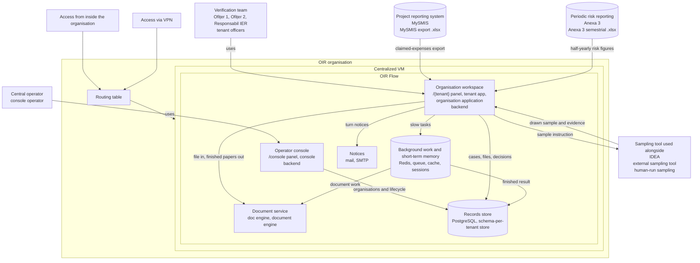

# C4 Level 2 — network overlay (draft)

Draft. Same six internal parts as `docs/miscellaneous/c4-level-2-aliases.md`. Overlay
only: SaaS on one centralized VM in the OIR organisation; reachability from inside the
organisation and via VPN; routing table at OIR organisation level. No addresses, ports,
or other hosting invent.

Logical parts sit on the one VM. Not a `docs/topology/` runtime; does not amend
`docs/architecture.md`.
