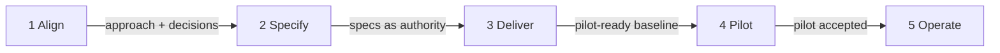
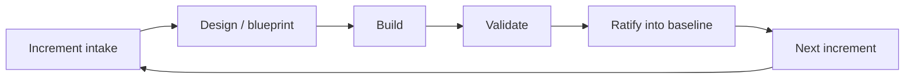
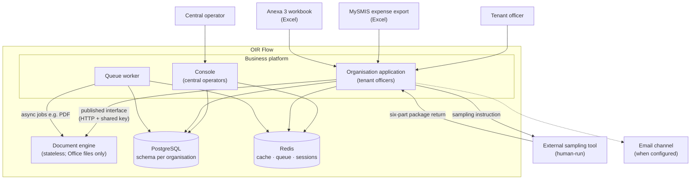

# Project Plan — OIR Flow

**Audience:** client stakeholders  
**Status:** abstract happy-flow plan for alignment (not a product specification; not an as-built PAD)  
**Evidence / plan date:** 2026-08-12  
**Note:** Forward-looking plan of the intended successful path. Where the plan designs beyond evidenced as-built material, those choices are logged in **§8**. This document does not replace the Project Approach Document or new ratified specifications.

---

## 1. Executive summary

OIR Flow is a multi-tenant platform for organisation officers and central operators to manage reimbursement / payment claim files (dosare) and the supporting risk register, with Office-file work isolated in a separate document engine. Delivery proceeds through five gates—**Align**, **Specify**, **Deliver**, **Pilot**, **Operate**—and, inside Deliver (and thereafter), a repeating loop of intake → design → build → validate → ratify. Product maturity is described as five stages that map onto those same phases only. Stakeholders are asked to accept this phase and stage model, close the open product decisions that unblock the first specification set, ratify dual deployable + published interface + organisation-separated data as the target architecture, accept the Development → CI → Pre-production → Production progression, and confirm a named-organisation pilot before full production use.

---

## 2. Project phasing

Phases are **gates**, not calendar blocks. Relative order only. They absorb the re-specification path already described in the Project Approach Document (approve approach → answer open decisions → write new specifications → ratify them as authority → resume delivery) and extend that path into pilot and production operation.

| Phase | Objective | Key inputs | Key outputs | Exit criterion |
|---|---|---|---|---|
| **1 — Align** | Shared picture of the current system and closed product choices that unblock specification | Project Approach Document (as-built + reconciliation); open decision list; stakeholder intent on scope | Approved approach; answered decision set (or explicit deferral of non-blocking items to a later increment) | Approach approved **and** decisions required for re-specification answered so specification work can start |
| **2 — Specify** | Turn reconciliation + decisions into the working product authority | Approved approach; decision answers; current software as baseline until rework lands | New specification set (keep / change / add / leave out); published interfaces for any cross-part changes in the first delivery increment | Specification set ratified as **working authority**; first-increment interfaces agreed before build |
| **3 — Deliver** | Build and verify agreed increments against the specifications (loop in §3) | Working specifications; increment backlog; published interfaces; existing dual-part baseline | Verified capability increments; updated baseline after each ratification; automated quality evidence | Per increment: acceptance met and baseline updated; **phase** exit when the pilot-ready capability set is ratified |
| **4 — Pilot** | Named organisations use the ratified capability set on real claim work | Pilot-ready baseline; named organisations; trained officers/operators; non-dev environments promoted for pilot | Live pilot use; structured feedback; residual change requests for later increments | Stakeholders accept that pilot outcomes support production operation |
| **5 — Operate** | Sustained production use under the ratified baseline, with continuous improvement as further increments | Production-ready baseline; production environment; authorised organisations; support ownership as agreed | Production service in use; improvement increments via the same intake → … → ratify loop | Steady operational use is the ongoing state; each improvement still exits via ratification |

How this relates to the Approach Document’s re-spec steps: steps 1–2 map into **Align**; steps 3–4 into **Specify**; step 5 is the start of **Deliver**. **Pilot** and **Operate** are the designed extension beyond that document.

---

## 3. Iterative architecture & incremental requirements

Delivery does not rewrite the whole product in one pass. After Align and Specify, work runs as a repeating **increment loop**. Architecture is elaborated only as far as each increment needs; each cycle ends with the shared baseline updated so the next cycle starts from clean truth.

**Loop in the happy path**

- **Increment intake** — Stakeholders and product owners name the next slice of value from the working specification (or from pilot / operate feedback). Scope is one increment, not a whole-product rewrite.
- **Design / blueprint** — Delivery elaborates only what that slice needs: interfaces published before build where platform and engine meet; behaviour described at the level needed to implement and accept.
- **Build** — Implementation against those interfaces and the working specification. Platform and document engine remain separate, coupled only through the published interface package.
- **Validate** — Automated checks (application, engine, interface, static analysis as already practiced) plus stakeholder-visible acceptance of the increment’s outcomes.
- **Ratify into baseline** — Accepted behaviour becomes the new shared truth; specifications and, where needed, interfaces are updated.
- **Next** — Residuals and new feedback become the following intake — no silent redesign.

**What stakeholders provide at intake**

- Priority slice (what becomes real next)
- Answers or confirmations that unblock that slice (including any still-open product decisions that affect it)
- Acceptance intent (what “good enough to ratify” means for this increment)

**What stakeholders receive at ratification**

- Demonstrable capability (or confirmed “no change / leave out”)
- Updated baseline statement (what is now agreed truth)
- Clear residual list for later increments (a queue for the next intake, not a failure register)

**Why this plan stays abstract.** Calendar, budget, and field- or screen-level detail are produced **per iteration**, not upfront. Active project documentation does not fix a multi-year phase calendar; the gate model and loop are how detail is created safely over time.

---

## 4. Product stages

Product stages describe **maturity of what is usable**. They are not a second schedule: each stage maps onto the phases in §2.

| Stage | What is usable | By whom | Feedback feeds |
|---|---|---|---|
| **Agreed baseline** | Current multi-tenant platform + document engine as documented (claim-file path, risk register, dual panels; interim limitations stated honestly) | Central operators, tenant officers already on the system; delivery team as reference | Phase 1 decisions; Phase 2 specification content |
| **Working specification** | Written authority for keep / change / add / leave-out; no claim that code already matches every future item | Stakeholders and product owners as scope authority; delivery team as implementers | Phase 3 increment selection and interface updates |
| **Delivery-ready capability** | Agreed increments verified in non-production (and CI); usable on test or internal organisations | Delivery team; selected internal / test operators | Next Deliver iterations; Phase 4 pilot gate |
| **Pilot service** | Ratified pilot scope available to named organisations on a promoted environment | Selected tenant officers and central operators | Pilot feedback into Deliver or into the Operate gate |
| **Production service** | Authorised organisations run day-to-day claim and risk work on production | Authorised officers and operators | Continuous improvement increments (Operate → loop in §3) |

### Stages mapped to phases (single timeline)

| Stage | Mapped phase(s) | Usable by | Feedback into |
|---|---|---|---|
| Agreed baseline | 1 — Align (throughout); remains reference until rework lands | Operators, officers, delivery team | Align decisions; Specify |
| Working specification | 2 — Specify (outcome of phase) | Stakeholders / product owners; delivery team | Deliver (increment intake) |
| Delivery-ready capability | 3 — Deliver | Internal/test users; delivery team | Further Deliver iterations; Pilot entry |
| Pilot service | 4 — Pilot | Selected organisations | Pilot ratification; Operate entry |
| Production service | 5 — Operate | Authorised organisations | Operate improvement iterations |

---

## 5. Proposed architecture

Target shape for this plan horizon. A few decisions stakeholders must understand; finer design stays inside the iteration loop.

**Architectural decisions (stakeholder view)**

1. **Two deployable parts, one published interface** — Business platform (console for central operators, organisation application for officers, plus background worker) and a **stateless document engine** (Office files only; no business database). Platform and engine couple **only** through a versioned interface package; the platform does not open Office files itself. **Only organisation claim/risk work and related background jobs call the engine** — the central console does not (it provisions organisations and manages console accounts).
2. **Custom build of the core product** — Purpose-built multi-tenant claim and risk platform for this process, not a generic purchased case-management product. Office processing stays isolated in the engine.
3. **Multi-tenancy by organisation** — Each organisation has separated durable data (schema-per-tenant on one database). Central operators use the console; officers use the organisation application path. Provisioning and lifecycle are first-class. A console account grants nothing inside an organisation.
4. **Integration posture: files and human-run sampling (current orientation)** — MySMIS expense export and Anexa 3 enter as Excel workbooks into the **organisation application**. Sampling extraction remains with an **external human-run tool** and a six-part package return to that application unless stakeholders later choose otherwise (that permanence decision stays open — see §8). Email is used from organisation claim work when a notification channel is configured.
5. **Durable state only on the platform** — PostgreSQL holds business state; Redis supports cache, queue, and sessions; the engine persists nothing. Heavy work such as PDF conversion may run via background jobs from organisation claim work; other engine calls are inline from the organisation application.
6. **Production topology mirrors the dual-deployable shape** — Same logical containers (platform web, queue worker, engine, PostgreSQL, Redis) on a non-development host — not a redesign into a single monolith, unless a later decision says otherwise.
7. **Quality gates travel with the architecture** — Interface checks, engine tests, platform tests, and static analysis remain the engineering proof that increments are safe to ratify. Product-level acceptance for pilot and production is additional and stakeholder-owned.

---

## 6. Deployment target

**Hosting model.** Development uses a full local stack (application, database, Redis, document engine, queue worker). Continuous integration runs automated gates on every relevant change. Pre-production and production are **promoted non-development hosts** that preserve the same dual-deployable logical services. Cloud vendor brands and commercial hosting contracts are out of scope for this plan. Operational ownership of non-development environments is confirmed when those environments are stood up.

| Environment | Purpose | Promotion criterion |
|---|---|---|
| **Development** | Local full stack for implementers | Change is complete enough to enter automated checks |
| **Continuous integration (CI)** | Automated gates (interface package, engine, platform, seam, static analysis) | All required gates for the change pass |
| **Pre-production (staging)** | Shared non-production host matching dual-deployable topology — acceptance demos, pilot rehearsal, stakeholder validation | Increment validated in CI **and** accepted against the working specification for that slice |
| **Production** | Authorised organisations run live work | Pilot (or equivalent stakeholder acceptance) complete for the scope being promoted; staging sign-off for that release train |

---

## 7. Functional design

Domains ordered by when they become **real and usable** in the happy path. Journeys are abstract: no fields, screens, or acceptance criteria (those are per-iteration work under §3).

### A. Organisations (tenancy) — foundation in Phases 1–3; live in 4–5

Central operators create and provision an organisation, suspend or restore it when needed, and consult lifecycle history. The system keeps that organisation’s data separated and ready for officers. This capability already exists as baseline and is confirmed or lightly reworked under the new specifications before pilot scale-out.

### B. People and access — foundation in Phases 1–3; live in 4–5

Operators and officers sign in to the correct panel (console vs organisation application), complete first-time password setup, and work under assigned roles. The system enforces session and panel separation. Delivery closes the agreed authorisation rules from the new specifications so the right people see the right claim work.

### C. Document processing (engine operations) — substrate across Phases 3–5

Whenever officers need Office-file inspect, population files, formal documents, PDF conversion, or sample-package checks, the platform calls the document engine through the published interface. The engine returns files and check results; the platform stores business outcomes. Delivery hardens interim pieces (for example real Anexa 3 parsing when specified) without merging the two deployables.

### D. Risk register — mid Phase 3; essential before full sampling value in 4–5

Officers maintain risk indices (manual and/or Anexa 3 path as decided), project–entity associations, and risk-class intervals, and consult the register when preparing determinations. The system records sources and history so sampling size and formal documents rest on an agreed risk picture. Specification answers on Anexa 3 as sole path and association import shape this journey’s final form.

### E. Claim-file (dosar) lifecycle — core of Phase 3; primary pilot value in 4–5

Officers intake a MySMIS expense export, prepare population, run preliminary verification, determine population and sample size, produce formal documents, complete the signature circuit, issue the sampling instruction, confirm the returned package, and record findings and the sample report. The system orders these steps, persists state per organisation, and coordinates document-engine work. This is the central happy path the pilot exercises end-to-end.

### F. Organisation settings — late Phase 3 if included by decision; real in 4–5

When specifications include them, tenant administrators set archive location and notification channel so assignment, signature, and sampling communications leave log-only placeholders. The system applies those settings to the claim journey. If stakeholders leave settings out for now, this domain stays out of pilot scope by authority of the specification.

### G. Portfolio / claim registry — late Phase 3 if included; strengthens 4–5 operations

When specifications include search, grouping, withdrawal, stage indicators, or institutional formats, officers monitor and find claim files beyond the basic list. The system presents portfolio views consistent with access rules. If item-by-item decisions leave some features out, the happy path is the agreed subset only.

**Reading order:** foundation (A–C) → risk (D) → full claim journey (E) → optional operational depth (F–G) once decisions and specifications say they are in.

---

## 8. Assumptions & deductions log

Honesty valve for every designed or deduced element used above. Pure restatements of evidenced as-built facts are omitted unless the plan **adopts them as forward target** or **extends** them.

| Item | Section | Basis | What confirms or overturns it |
|---|---|---|---|
| Five phase gates: Align → Specify → Deliver → Pilot → Operate | §2 | Designed — no phase model in active project docs; Approach Document re-spec stops at “resume delivery”; conventions describe contract-first iteration, not calendar phases | Stakeholder-approved phase model; or supply an alternate ladder |
| Align merges approach approval + blocking decisions (Approach Document re-spec steps 1–2) | §2 | Deduced from Approach Document delivery path and open decision list | Keep as two separate stakeholder gates; or allow Specify to start with partial answers for non-blocking items only |
| Specify packages new specs + ratification as working authority (re-spec steps 3–4) | §2 | Evidenced path in Approach Document; packaging as one phase is designed | Split “write” vs “authority” into two phases if governance requires a formal ratification event |
| Deliver / Pilot / Operate extension beyond Approach Document re-spec | §2 | Designed — no source for pilot/operate gates in active docs | Different post-delivery model (e.g. no distinct pilot) |
| Current software remains baseline until rework lands | §2, §4 | Evidenced — Approach Document delivery posture | Decision to freeze or replace baseline earlier |
| Product stages: Agreed baseline → Working specification → Delivery-ready → Pilot service → Production service | §4 | Designed — no maturity ladder in active docs | Prefer other labels or fewer stages |
| Stages map only onto §2 phases (no second timeline) | §4 | Designed — plan rule + design choice | Force independent stage dates (would violate plan rules) |
| Iteration loop: intake → design → build → validate → ratify → next | §3 | Deduced from contract-first delivery practice, verify-before-done, and “no silent redesign” | Different operating model mandated by stakeholders |
| Stakeholder artefacts at intake (priority slice, unblocking answers, acceptance intent) | §3 | Designed — plain-language packaging of delivery signals | Different RACI or artefacts |
| Stakeholder artefacts at ratification (demo, updated baseline, residual backlog) | §3 | Designed | Formal sign-off templates or external PMO artefacts required |
| Plan remains abstract because detail is per iteration | §3 | Deduced from plan framing + absence of calendar/budget in active docs | Stakeholders require upfront full work breakdown and dates |
| Retain dual deployable + published interface as **target** architecture | §5 | Evidenced as-built; **forward retention** is a design stance | Merge/split deployables; replace interface-first seam |
| Schema-per-tenant multi-tenancy retained as target | §5 | Evidenced as-built | Different tenancy model in new specifications |
| External sampling tool + six-part package as **current orientation** (not declared permanent) | §5, §7 | Evidenced today; permanence is an open product decision | Answer: keep external vs require in-app extraction |
| Platform attestation vs qualified electronic signature (QES) not resolved in plan body | §5, §7 | Open product decision; Approach Document notes provisional attestation | Answer attestation vs QES |
| Production topology = non-dev host matching dual-deployable logical services | §5, §6 | Designed — production hosting not evidenced (dev + CI only) | Named hosting model, network zones, or managed-service choices |
| Environment chain: Development → CI → Pre-production (staging) → Production | §6 | Dev + CI evidenced; staging + production progression **designed** | Skip staging; add more environments; different promotion path |
| Promotion criteria as one-line gate checks in §6 table | §6 | Designed — no promotion policy in active docs | Formal release policy |
| Product-level acceptance for pilot/operate beyond CI | §2, §4, §6 | Designed — CI evidenced; product definition of done for pilot/production not in active docs | Explicit product acceptance document from stakeholders |
| Production email = configured channel only; no vendor brand | §5, §6 | Designed neutrality — provider not evidenced | Mandate specific mail provider or on-premises relay |
| Functional domain set and happy-flow journeys (A–G) | §7 | Domain list evidenced; journey compression and **phase ordering** designed | Add/remove domains; reorder by another priority |
| Settings and portfolio appear late and only if specifications include them | §7 | Deduced from placeholder / pending status + open product decisions | Early mandatory inclusion regardless of those decisions |
| Anexa 3 / association-import final shape deferred to specification answers | §7 | Open product decisions; interim/mock paths in Approach Document | Closed answers in Approach Document decision list |
| ADDED capabilities handled via specification policy, not silent drop/keep in this plan | §2–§3 | Open product decision in Approach Document | Blanket accept or descope without per-cluster review |
| Interface versioning ownership left open | §5 | Open product decision; not resolved here | Named ownership of version policy |
| Docs ownership for stories/backlog and historical definitions left to confirmations | §3, §8 shortlist | Open product decisions; not resolved here | Governance change or rewrite-without-archive policy |
| Diagram of environment progression omitted; env table sufficient | §6 | Designed — table equals clarity for a linear chain | Require a fourth Mermaid diagram |
| No calendar dates, budget, FTE, or cloud vendor brands in plan | global | Plan rules + absence in active docs | Inject commercial schedule or budget |
| English-only stakeholder plan | global | Plan assumption | Bilingual Romanian / English |
| Open Approach Document decisions treated as confirmations that harden assumptions, not as already answered | §8 shortlist | Continuity with Approach Document §8 still open | Paste answers to freeze design |

### Shortlist — load-bearing stakeholder confirmations (≤5)

1. **Accept the five phase gates** (Align → Specify → Deliver → Pilot → Operate), including pilot as a distinct gate before full production.
2. **Close product decisions that shape the first specification set** — especially sampling model (external vs in-app), signatures (attestation vs QES), portfolio include/leave-out, tenant settings include/leave-out, and policy for capabilities built but never written in the old Prototype A set.
3. **Ratify dual deployable + published interface + schema-per-tenant as the target architecture** for this plan horizon (not only as as-built description).
4. **Accept environment progression** Development → CI → Pre-production → Production on a non-development topology that preserves platform + engine + PostgreSQL + Redis + worker.
5. **Confirm pilot scope pattern** — named organisations, ratified capability set, structured feedback into the same iteration loop — as the happy path into Operate.
